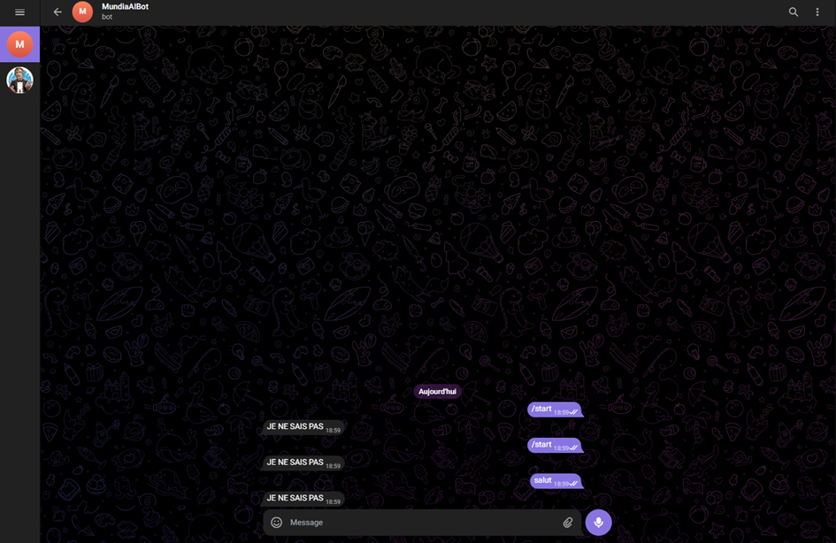
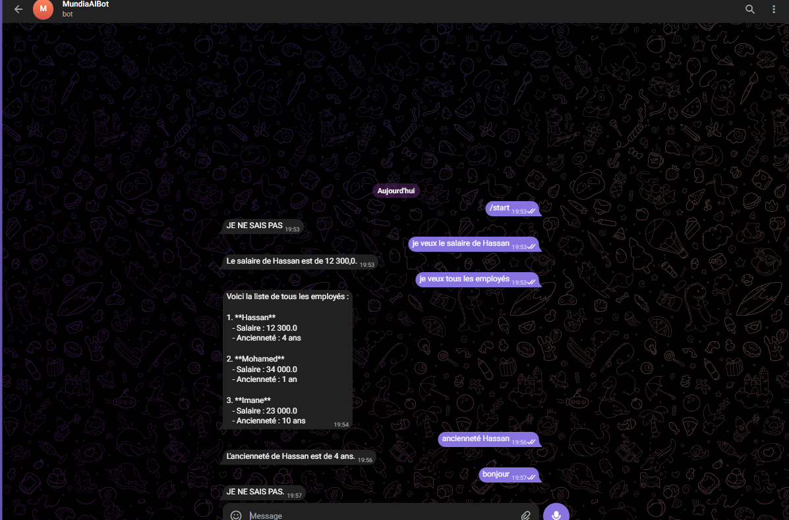

---

# Chatbot Telegram avec Spring Boot et OpenAI

## Description

Ce projet est un **chatbot Telegram** développé avec **Spring Boot**. Il permet aux utilisateurs d’échanger des messages avec le bot, qui utilise l’**API OpenAI** pour générer des réponses intelligentes et contextuelles.

Pour rendre l’interaction plus naturelle, le bot affiche une action de saisie (*typing*) avant d’envoyer chaque réponse générée par l’IA.

---

## Fonctionnalités principales

* **Envoi et réception de messages** via la **Telegram Bot API**.
* **Génération de réponses intelligentes** avec l’**OpenAI Chat API** en tenant compte du contexte des conversations.
* **Gestion des erreurs** : si l’API OpenAI rencontre un problème (par exemple, quota épuisé), le bot répond automatiquement par *"JE NE SAIS PAS"*.
* **Simulation de saisie** : le bot montre l’action `typing` pour imiter une conversation humaine.

---

## Prérequis

Pour exécuter le projet, vous aurez besoin de :

* **Java 17** ou supérieur
* **Maven 3.8+**
* Un **compte Telegram** avec **Token de bot** valide
* Un **compte OpenAI** avec **clé API** valide

---

## Installation et configuration

1. **Cloner le projet** :

```bash
git clone <URL_DU_PROJET>
cd <NOM_DU_PROJET>
```

2. **Configurer les variables d’environnement** pour le bot Telegram et l’API OpenAI :

```bash
TELEGRAM_BOT_TOKEN=<votre_token_telegram>
OPENAI_API_KEY=<votre_cle_api_openai>
```

3. **Compiler et exécuter le projet avec Maven** :

```bash
mvn clean install
mvn spring-boot:run
```

---

## Gestion des erreurs

* **Quota OpenAI insuffisant / HTTP 429** :
  Si le crédit de l’API OpenAI est épuisé, toutes les requêtes vers l’API échouent. Dans ce cas, le bot renvoie automatiquement *"JE NE SAIS PAS"*.
  

* **Autres erreurs** :
  Toutes les exceptions sont gérées de manière à éviter que le bot ne plante, et un message par défaut est renvoyé à l’utilisateur.

---

## Améliorations possibles

* Ajouter un **système de contexte avancé** pour gérer des conversations multi-tour plus complexes.
* Intégrer des **réponses personnalisées** selon l’utilisateur ou le type de message.
* Supporter d’autres **plateformes de messagerie** en plus de Telegram.

---

